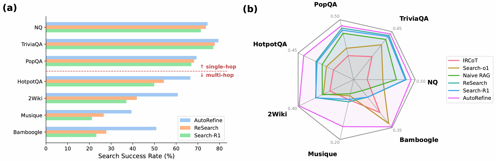

# AutoRefine

## 🔥News

- Paper is available on \[[Arxiv](https://www.arxiv.org/pdf/2505.11277)\]
- Checkpoints are released at \[[🤗HuggingFace](https://huggingface.co/yrshi/AutoRefine-Qwen2.5-3B-Base)\].


Official implementation of paper *Search and Refine During Think: Autonomous Retrieval‑Augmented Reasoning of LLMs*.

AutoRefine is an RL post-training framework that adopts a new "search-and-refine-during-think" paradigm. It introduces:
- explicit **knowledge refinement steps** between successive search calls, enabling the model to iteratively filter, distill, and organize evidence before generating an answer.
- tailored **retrieval-specific rewards** alongside answer correctness rewards to guide the searching behaviors.




## 🛠️Installation

**Main Environment**

The enrivonment for training/testing of AutoRefine can be built by running:

```bash
conda create -n autorefine python=3.9
conda activate autorefine
pip install torch==2.4.0 --index-url https://download.pytorch.org/whl/cu121
pip3 install vllm==0.5.4

# build verl
pip install -e .

# flash attention 2
pip install flash-attn==2.7.0.post2
pip install wandb
```

**Retrieval Environment**

This environment is for the local retrieval server.

```bash
conda create -n faiss_env python=3.10
conda activate faiss_env

conda install pytorch==2.4.0 torchvision==0.19.0 torchaudio==2.4.0 pytorch-cuda=12.1 -c pytorch -c nvidia
pip install transformers datasets pyserini

conda install -c pytorch -c nvidia faiss-gpu=1.8.0

pip install uvicorn fastapi
```

## 📂Data Preparation

### Retrieval Corpus

```bash
save_path=./data
python preprocess/download.py --save_path $save_path
cat $save_path/part_* > $save_path/e5_Flat.index
gzip -d $save_path/wiki-18.jsonl.gz
```

### Training/Evaluation Dataset

We download the data for model training/evaluation from [FlashRAG Collection](https://huggingface.co/datasets/RUC-NLPIR/FlashRAG_datasets).

To download and build the dataset, run:
```bash
bash preprocess/scripts/data_process.sh
```
This will merge the training set of NQ and HotpotQA as the training data, and merge the test/dev sets of `nq,triviaqa,popqa,hotpotqa,2wikimultihopqa,musique,bamboogle` as the test set.

## 🚀Reproduction

### Retirever Server

Before running the code for training/evaluation, you need to load the retrieval server first:
```bash
conda activate faiss_env
bash retrieval_launch.sh
```
This will start a server listening on `http://127.0.0.1:8000/retrieve`.

### Training

To reproduce the result in the paper (Table 1), run the following code for training:
```bash
conda activate autorefine
bash cmd/train.sh
```
The script above will train the model for 300 steps while saving checkpoints with (1) highest reward (2) highest evaluation accuracy.

If you want to log the results onto `wandb`, you may set the `wandb_token` and `WAND_PROJECT` variables in the scripts to your wandb token and prefered project name.

### Inference

For evaluation, run:
```bash
conda activate autorefine
bash cmd/eval.sh
```

## 🙏Acknowledgements

This project is built upon the foundational work of [VeRL](https://github.com/volcengine/verl) and [Search-R1](https://github.com/PeterGriffinJin/Search-R1).
We sincerely thank the authors of these projects for their valuable contributions, which have significantly supported and inspired our work.

## 🎓Citations

```latex
@article{AutoRefine,
    title={Search and Refine During Think: Autonomous Retrieval-Augmented Reasoning of LLMs},
    author={Yaorui, Shi and Shihan, Li and Chang, Wu and Zhiyuan, Liu and Junfeng, Fang and Hengxing, Cai and An, Zhang and Xiang, Wang},
    journal={arXiv preprint arXiv:2505.11277},
    year={2025}
}
```